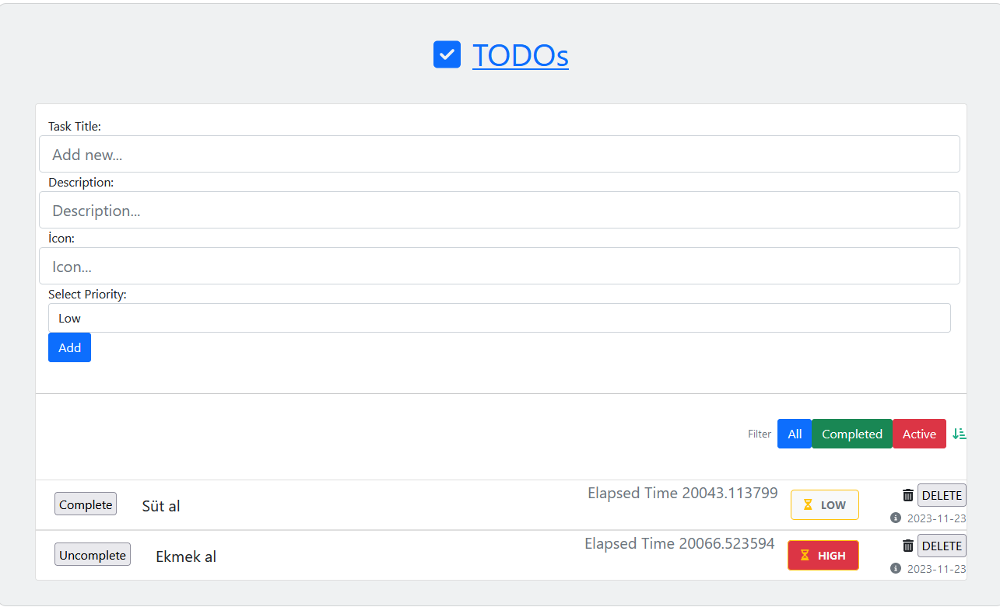

## TODO App - Django RESTFramework
*In this application, we wrote an API with django restframework and made a postgresql connection.*
*For portability and reusability of the project, you can run with docker compose.*

### Install & Usage (Without Docker)

- *Setup your own hostname for DEVELOPMENT condition in todoapp/settings.py*
- *You can learn from socket library*
```
import socket
socket.gethostname()
"yourhostname"
```
- *Clone the repository:*
```
git clone https://github.com/erkamesen/TodoApp.git
```
- *Navigate to directory:*
```
cd TodoApp/
```
- *Create and activate virtual environment(Optional):*
```
python -m venv venv
```
**MacOS & Linux**
```
source /venv/bin/activate
```
**Windows**
```
.\venv\Scripts\activate
```
- *Install Dependencies:*
```
pip install -r requirements.txt
```
- *Make Migrations:*
```
python manage.py makemigrations
python manage.py migrate
```
- *Create superuser*
```
python manage.py createsuperuser
```
- *Run server:*
```
python manage.py runserver
```

### Install & Usage (With Docker)
- *Setup your own hostname for DEVELOPMENT condition in todoapp/settings.py*
- *You can learn from socket library*
```
import socket
socket.gethostname()
"yourhostname"
```
- *Clone the repository:*
```
git clone https://github.com/erkamesen/TodoApp.git
```
- *Navigate to directory:*
```
cd TodoApp/
```
- *Setup your docker container:*
```
docker-compose up
```
- *Make migrations in container with shell*
- *Connect to bash:*
```
docker exec -it <container_id> /bin/bash
```
**You can learn container id with "docker ps" command.
```
docker ps
"""
CONTAINER ID   IMAGE
a0998116850c   todoapp-todoapp
9dc0bfdb5d27   postgres:13.1
"""
```

- *Make Migrations:*
```
python manage.py makemigrations
python manage.py migrate
```
- *Create superuser*
```
python manage.py createsuperuser
```

